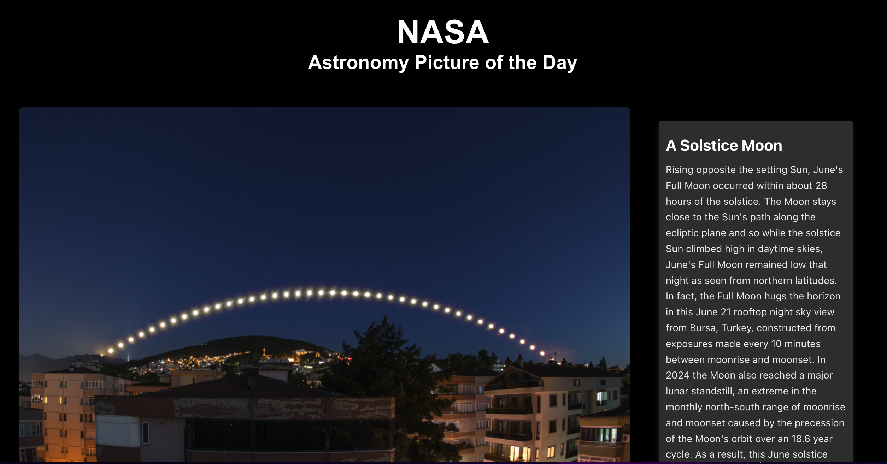

# NASA Astronomy Picture of the Day Viewer

This React application displays the Astronomy Picture of the Day provided by NASA's open API. It features a responsive design to showcase the daily image along with its title, explanation, and date of capture. The app utilizes Axios for API requests, demonstrating a basic pattern for fetching and displaying data in a React application.

## Features

- **Daily Astronomy Picture**: Displays the image provided by NASA along with details such as the title, description, and the date it was featured.
- **Responsive Design**: Adapts smoothly to different screen sizes, ensuring a great user experience on mobile, tablet, and desktop.
- **Error Handling**: Implements basic error handling in case the API fails to fetch the data.

## Usage

Simply open the app in your browser, and it will automatically fetch and display the Astronomy Picture of the Day along with its relevant details. If there's an issue with fetching data, the app will display an error message.

## Screenshot

## License

Distributed under the MIT License. See `LICENSE` for more information.
